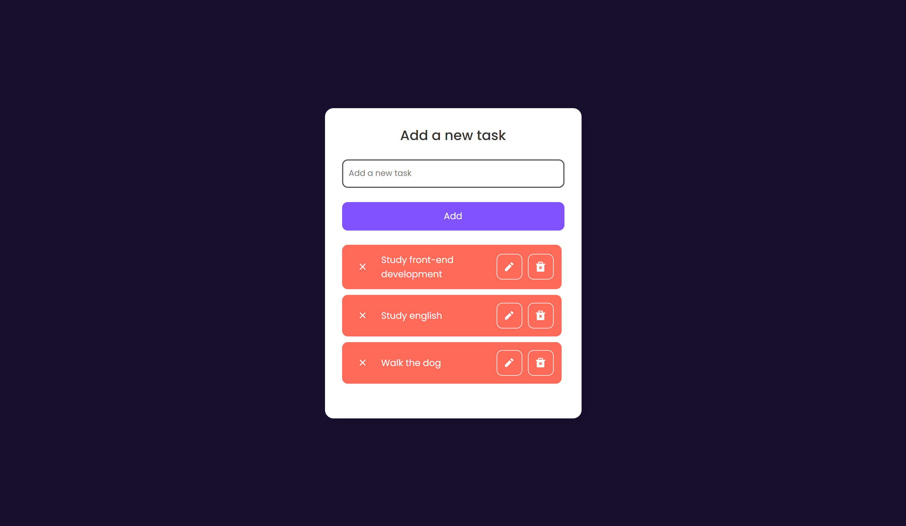

# Todo list with React

> For my first React project, I decided to build a todo-list app to practice. In this app, you may be able to add new tasks, edit them and delete them! It was built with HTML CSS and REACT !

🔗 [click here to access]()

## 🔧 Used technologies:
- HTML
- CSS
- React

## 😎 Contact me:

c.hidekimiyaji@gmail.com
